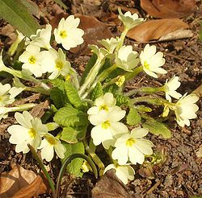

layout: false
class: inverse

# Com(p)adre

```{r setup, include=FALSE}
options(htmltools.dir.version = FALSE)
```

---

# Com(p)adre

COM(P)ADRE es un repositorio onine de modelos de matrices poblacionales, así como
metadatos de plantas, animales, bacterias, virus, algas y hongos.

Se separa en dos bases de datos, COMADRE para animales, bacterias y virus, y 
COMPADRE para plantas, algas y hongos.

https://compadre-db.org/


.pull-left[]
.pull-right[]  

---

# Compadre en R

Lo primero que tenemos que hacer es instalar las librerías de R que vamos a necesitar y cargarlas para poder
usarlas

```{r, eval = FALSE}
install.packages('Rcompadre')
install.packages('sf')
install.packages('dplyr')
install.packages('ggplot2')

# Ahora cargamos los paquetes
library(Rcompadre)
library(popdemo)
library(sf)
library(dplyr)
library(ggplot2)
```

```{r, echo=FALSE}
# Ahora cargamos los paquetes
library(Rcompadre)
library(popdemo)
library(sf)
library(dplyr)
library(ggplot2)
```

---

# Compadre en R

```{r}
# Obtener la última versión de compadre -----------------------------------------------------------------
# guardar la bd
compadre_db <- cdb_fetch('compadre')
```

---
class: .code80

# Compadre en R

```{r}
# comprobar que tenemos lo que queremos
compadre_db
```

---
class: .code80

# Compadre en R

```{r}
# comprobar que tenemos lo que queremos
names(compadre_db)
```

---
class: .code80

# Compadre en R

```{r}
# Comprobar especies ------------------------------------------------------------------------------------
# Podemos comprobar si nuestras especies de interes están presentes
species_wanted <- c("Pinus nigra", "Acer saccharum")
cdb_check_species(compadre_db, species_wanted)
```

---
class: .code80

# Compadre en R

```{r}
# Podemos comprobar y a la vez sacar los datos para esas especies
compadre_species_wanted <- cdb_check_species(compadre_db, species_wanted, return_db = TRUE) 
compadre_species_wanted
```

---

# Compadre en R

## *Primula vulgaris*, un ejemplo de uso de COMPADRE


.pull-left[.center[]]
.pull-right[
Vamos a hacer un ejemplo con *Primula vulgaris*, una primulácea común en la península.
]

---
class: .code80

# Compadre en R

```{r}
# Más específico, Primula vulgaros solamente en España
compadre_primula_spain <- subset(
  compadre_db,
  SpeciesAccepted == 'Primula vulgaris' & Country == 'ESP'
)
# comprobamos que, efectivamente, solo tenemos datos para Primula en España
compadre_primula_spain$SpeciesAccepted
compadre_primula_spain$Country
```

---
class: .code80

# Compadre en R

```{r}
# Extraer matrices --------------------------------------------------------------------------------------
# Podemos sacar matrices de población
primula_matA <- matA(compadre_primula_spain)

# Para saber a que corresponden los estadíos (A1, A2...)
matrixClass(compadre_primula_spain)
```

---
class: .code80

# Compadre en R

```{r}
# Podemos obtener diferentes parámetros, como lambda, para cada una de las matrices:
# individualmente:
eigs(primula_matA[[1]], what = 'lambda')
# todas a la vez:
primula_lambdas <- sapply(primula_matA, eigs, what = 'lambda')
summary(primula_lambdas)
```

---
class: .code80

# Compadre en R

```{r}
# todas a la vez:
hist(primula_lambdas)
```

---
class: .code80

# Compadre en R

```{r}
# Calcular dinámicas a partir de una población inicial --------------------------------------------------
# Creamos la matriz de población inicial a partir de los datos que hemos obtenido:
initial_pop_matrix <- matrix(c(50, 38, 26, 80), byrow = FALSE, ncol = 1)

# ahora podemos saber que población tendremos en el siguiente ciclo reproductivo
primula_matA[[1]] %*% initial_pop_matrix
```

---
class: .code80

# Compadre en R

```{r}
# O hacer un bucle (loop) para tener los próximos 25 ciclos
dinamica_primula_25 <- initial_pop_matrix
for (year in 1:25) {
  dinamica_primula_25 <- cbind(
    dinamica_primula_25,
    round(primula_matA[[1]] %*% dinamica_primula_25[,year], 0)
  )
}
dinamica_primula_25
```

---
class: .code80

# Compadre en R

```{r, fig.width=7, fig.height=4, fig.align='center'}
# Y con esto hacer una gráfica con la tendencia
transposed_data <- as.data.frame(t(dinamica_primula_25))
transposed_data$cycle <- 0:25

plot(transposed_data$cycle, transposed_data$A1, col = 'blue', type = 'l', ylim = c(0,180))
lines(transposed_data$cycle, transposed_data$A2, col = 'red', type = 'l')
lines(transposed_data$cycle, transposed_data$A3, col = 'yellow', type = 'l')
lines(transposed_data$cycle, transposed_data$A4, col = 'green', type = 'l')
```

---
class: .code80

# Compadre en R

```{r, fig.width=7, fig.height=4, fig.align='center'}
# Otra forma
transposed_data %>% 
  tidyr::pivot_longer(cols = A1:A4, 'Estadío') %>%
  ggplot(aes(x = cycle, y = value, color = Estadío)) +
  geom_line()
```

---
layout: false
class: inverse

# GBIF

---

# GBIF

GBIF (Global Biodiversity Information Facility) es una red internacional, así como una infraestructura de datos financiada y mantenida por
diferentes gobiernos de todo el mundo cuyo objetivo es proveer de datos abierto sobre todo tipo de vida
en la tierra.

En cuanto a lo que nos interesa hoy, ofrece datos de presencia de especies en todo el mundo, basados en
datos suministrados por investigadores, gobiernos...

.center[]

---
class: .code80

# GBIF en R

```{r, eval=FALSE}
# Acceso a la base de datos GBIF ------------------------------------------------------------------------
# Primer paso es instalar los paquetes si no los tenemos instalados
install.packages('spocc')
install.packages('mapr')

# Ahora cargamos los paquetes
library(spocc)
library(mapr)
library(dplyr)
```

```{r echo = FALSE}
# Ahora cargamos los paquetes
library(spocc)
library(mapr)
library(dplyr)
```

---
class: .code80

# GBIF en R

```{r}
# Consultar datos para una especie ----------------------------------------------------------------------
primula_gbif <- occ(query = 'Primula vulgaris', from = 'gbif', has_coords = TRUE, limit = 1000)
primula_gbif
```

---
class: .code80

# GBIF en R

```{r, fig.width=7, fig.height=4, fig.align='center'}
# Plotear el mapa ---------------------------------------------------------------------------------------
map_ggplot(primula_gbif, map = "world")
```

---
class: .code80

# GBIF en R

```{r, fig.width=7, fig.height=4, fig.align='center'}
# Plotear el mapa ---------------------------------------------------------------------------------------
map_leaflet(primula_gbif)
```